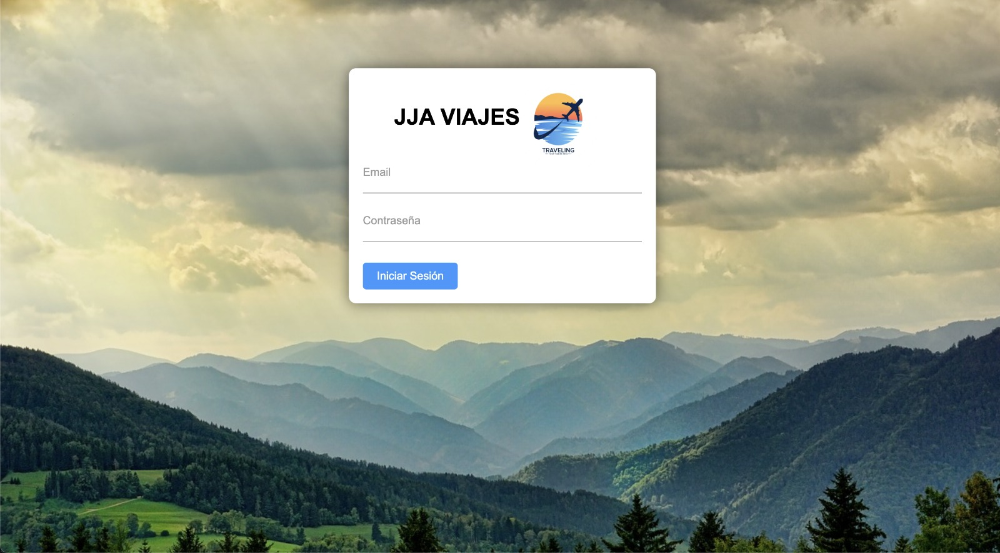

<!-- PROJECT SHIELDS -->

[![Forks][forks-shield]][forks-url]
[![Stargazers][stars-shield]][stars-url]
[![Issues][issues-shield]][issues-url]

# JJA-Viajes WebApp



Aplicación web para consultar y mostrar información sobre vuelos, desarrollada como parte de un proyecto grupal. Utiliza Flask como framework principal, integrando las APIs de Ryanair y Skyscanner para obtener datos de vuelos en tiempo real.

---

## Tabla de Contenidos
1. [Descripción General](#descripcion-general)
2. [Requisitos](#requisitos)
3. [Cómo Ejecutar la Aplicación](#como-ejecutar-la-aplicacion)
4. [Despliegue con Docker](#despliegue-con-docker)
5. [Contacto](#contacto)

---

## Descripción General

Esta aplicación permite a los usuarios buscar vuelos con información relevante como:
- Origen y destino.
- Fecha del vuelo.
- Número de vuelo, tarifa regular, moneda, asientos disponibles.
- Duración y horarios de salida y llegada.

La interfaz está diseñada para ser intuitiva y visualmente atractiva, con un formulario interactivo que incluye un calendario y listas desplegables para facilitar la selección de opciones.

<p align="right">(<a href="#">volver arriba</a>)</p>

---

## Requisitos

### Requisitos del Sistema
- Python 3.8 o superior
- Docker (opcional para despliegue)

### Instalación de Dependencias
Para instalar las dependencias necesarias, ejecuta:
```bash
pip install -r requirements.txt
```

---

## Cómo Ejecutar la Aplicación

Para ejecutar esta aplicación web, sigue los pasos a continuación:

1. **Descarga los archivos necesarios**:
   - Asegúrate de tener en la misma carpeta:
     - `index.py`
     - La carpeta `templates` con el archivo `home.html`.

2. **Accede a la carpeta del proyecto**:
   - Usa la terminal para navegar al directorio donde están los archivos:
     ```bash
     cd /ruta/a/tu/carpeta
     ```

3. **Instala Flask (si no está instalado)**:
   - Instala Flask con el siguiente comando:
     ```bash
     pip install Flask
     ```

4. **Ejecuta la aplicación**:
   - Inicia la aplicación ejecutando el archivo `index.py`:
     ```bash
     python3 index.py
     ```

5. **Abre la aplicación en tu navegador**:
   - Accede a la aplicación ingresando esta dirección en tu navegador:
     ```
     http://127.0.0.1:5000
     ```
     o
     ```
     http://localhost:5000
     ```

6. **Usa la aplicación**:
   - Primero, inicia sesión en la aplicación web.
   - Rellena los campos de búsqueda: `Origen`, `Destino` y `Fecha`.
   - Presiona el botón **Buscar** para obtener la lista de vuelos disponibles con detalles como:
     - Origen, destino, número de vuelo, tarifa, moneda, asientos disponibles, horarios y duración.

<p align="right">(<a href="#">volver arriba</a>)</p>

---

## Despliegue con Docker

Sigue los pasos a continuación para desplegar la aplicación usando Docker:

1. **Descarga los archivos necesarios**:
   - Asegúrate de tener:
     - `Dockerfile`
     - `index.py`
     - `requirements.txt`
     - La carpeta `templates` con el archivo `home.html`.

2. **Instala Docker** (si no está instalado):
   - Para instalar Docker en sistemas basados en Ubuntu, ejecuta los siguientes comandos:
     ```bash
     sudo apt-get install apt-transport-https ca-certificates curl software-properties-common
     curl -fsSL https://download.docker.com/linux/ubuntu/gpg | sudo apt-key add -
     sudo add-apt-repository "deb [arch=amd64] https://download.docker.com/linux/ubuntu $(lsb_release -cs) stable"
     sudo apt-get update
     sudo apt-get install docker-ce
     ```

3. **Construye la imagen de Docker**:
   - Dentro del directorio donde están los archivos, ejecuta:
     ```bash
     sudo docker build -f Dockerfile -t jjaviajes:latest .
     ```

4. **Ejecuta el contenedor**:
   - Despliega la aplicación con el siguiente comando:
     ```bash
     sudo docker run -p 2001:5000 -i jjaviajes
     ```

5. **Accede a la aplicación**:
   - Abre tu navegador y dirígete a:
     ```
     http://127.0.0.1:2001
     ```
     o
     ```
     http://localhost:2001
     ```

6. **Comandos adicionales de Docker**:
   - Verifica que Docker esté instalado:
     ```bash
     sudo docker info
     ```
   - Comprueba que la imagen se ha creado:
     ```bash
     sudo docker image ls
     ```
   - Guarda la imagen en un archivo tar:
     ```bash
     sudo docker save jjaviajes > contenedor.tar
     ```

<p align="right">(<a href="#">volver arriba</a>)</p>


---

## Contacto

Equipo de Desarrollo:
* Jesús García-Peñuela Molina-Prados (Frontend)
* Ángela Gijón Flores (Testing)
* Jesús Sánchez Cambronero Campos (Backend)
  
Correo Electrónico: [jesuusgpmp14.2002@gmail.com](mailto:jesuusgpmp14.2002@gmail.com)

<p align="right">(<a href="#">volver arriba</a>)</p>


[forks-shield]: https://img.shields.io/github/forks/JESUSGPMP14/JJA-Viajes.svg?style=for-the-badge
[forks-url]: https://github.com/JESUSGPMP14/JJA-Viajes/network/members
[stars-shield]: https://img.shields.io/github/stars/JESUSGPMP14/JJA-Viajes.svg?style=for-the-badge
[stars-url]: https://github.com/JESUSGPMP14/JJA-Viajes/stargazers
[issues-shield]: https://img.shields.io/github/issues/JESUSGPMP14/JJA-Viajes.svg?style=for-the-badge
[issues-url]: https://github.com/JESUSGPMP14/JJA-Viajes/issues